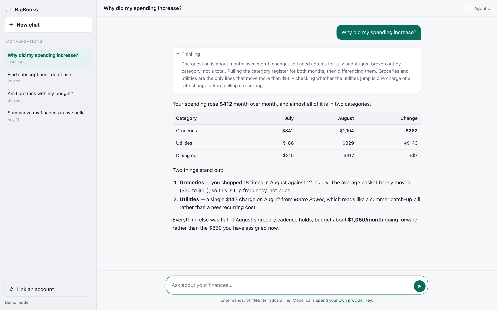
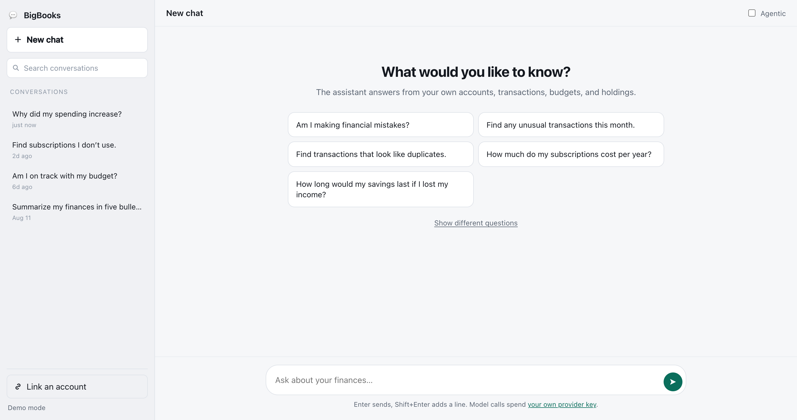
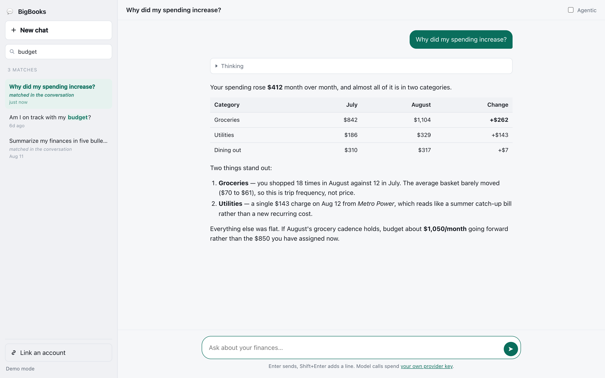

# BigBooks AI Assistant

A chat client for the [BigBooks](https://www.bigbooks.app) AI conversation API — ask questions
about your own accounts, transactions, budgets, and holdings and get answers computed from your
books. **Fully static**: no backend, no build step, no dependencies, just HTML, CSS, and vanilla
JS. Authentication is **OAuth 2.0 Authorization Code + PKCE** entirely in the browser, so there
is no client secret to protect and nothing runs server-side.



<sup>Screenshots from `#demo` mode — synthetic data and canned answers, no account or model key needed.</sup>

It shows:

- **Streamed answers** over server-sent events, rendered as markdown — tables, lists, code, and
  emphasis, which is most of what a finance assistant actually emits
- **The model's thinking**, when the provider surfaces it: open while it streams, collapsed once
  the answer arrives, and preserved when you reload the conversation later
- **Conversation history** in a scrollable column on the left; click any conversation to reload
  its whole transcript, or **New chat** to start over
- **Search over that history**, server-side and across the message text, not just the titles —
  so "groceries" finds the conversation where you asked about groceries even if its title
  never says so
- **An empty state that suggests five questions**, sampled from a larger pool, so the first turn
  is one click rather than a blank page
- **Plaid account linking**, because the assistant answers from your data and there is nothing to
  answer from until something is linked
- **Stop**, which ends an in-flight turn server-side and keeps the partial answer



Search runs on the server and covers the message text, so a conversation whose title never
mentions the word still turns up. Those rows say so, rather than leaving you to wonder why
they matched:



## Bring your own keys

This app spends **two** sets of third-party credentials, and BigBooks ships neither. Both are
stored on your BigBooks account, never in this repository.

| What | Where you store it | What it costs you |
| --- | --- | --- |
| A **model provider key** — OpenAI, Anthropic, Google, DeepSeek, or MiniMax | <https://www.bigbooks.app/secrets> | Every answer is a call billed to your provider account |
| Your **Plaid client id and secret** | <https://www.bigbooks.app/data-secrets> | Every linked institution is billed to your Plaid account |

**Both are stored per party, and the party that matters is the one that owns the OAuth client
this app signs in with** — the account you were signed in as at
<https://www.bigbooks.app/clients> when you created the client. Register the client under one
account and store credentials under another and both halves fail.

**There is nowhere in this repository to put either one**, and that is deliberate: anything in
`config.js` ships to every browser that loads the page.

### The model key

Every answer is generated by calling your chosen provider with **a key you stored yourself**.
Add one at **<https://www.bigbooks.app/secrets>**. Without it the first message comes back with
an error instead of an answer — the app detects that case and links you straight to the page.
The API takes no `apiKey` on the wire; provider selection comes from the stored-key pool alone.

### The Plaid credentials

Linking an account calls Plaid with **a client id and secret you stored yourself**. Add them at
**<https://www.bigbooks.app/data-secrets>**; you get both from the
[Plaid dashboard](https://dashboard.plaid.com/developers/keys). Without them the first call of
the link flow fails with `500 internal_error` and the message *"Plaid secret could not be
resolved"*.

The API does accept `X-Plaid-Client-ID` and `X-Plaid-Secret` headers as a fallback for
server-side callers, but stored credentials take precedence over them and a browser app must
never send them. Your Plaid environment matters too: sandbox credentials only open sandbox
institutions (use Plaid's test logins), production credentials need Plaid to have approved your
account for production access.

This one is easy to skip and then wonder why the assistant has nothing to say — it answers from
your ledger, and the ledger is empty until an institution is linked.

## How it works

```
Browser (this static app)
  │  1. Authorization Code + PKCE   ──►  www.bigbooks.app/oauth2/authorize + /oauth2/token
  │  2. GET /oauth2/userInfo        ──►  the `bigbooks:party` claim (your party id)
  │       (skipped when the id_token already carries the claim)
  │  3. GET  /v1/ai/conversations           ──►  the history column
  │  4. POST /v1/ai/conversations/start/stream  ──►  first turn, as SSE
  │  5. PUT  /v1/ai/conversations/{id}/stream   ──►  every turn after that, as SSE (If-Match)
  │  6. GET  /v1/ai/conversations/{id}      ──►  the persisted transcript + the next version
  │  7. POST /v1/ai/conversations/{id}/stop ──►  end an in-flight turn, keep the partial answer
  └► POST /v1/plaid/public/token → Plaid Link → POST /v1/plaid/access/token
```

Every call sends `X-Acting-Party-ID: <your party id>`. The access token lives only in
`sessionStorage` for the current tab.

### The event stream

Both streaming endpoints emit the same four event types:

| Event | Payload | What to do with it |
| --- | --- | --- |
| `conversation` | `{"id":…,"version":…}` | Arrives first. For a new conversation this is the only place the id appears before the end, and **Stop** needs it. |
| `thinking` | raw text chunk | The model's reasoning. Concatenate in arrival order. |
| *(unnamed)* | raw text chunk | A chunk of the answer. Concatenate in arrival order. |
| `done` | `{"id":…}` | Terminal success. |
| `error` | `{"code":…,"message":…}` | Terminal failure raised *after* the stream opened. Failures the server can detect before that are HTTP statuses instead — see below. |

Lines beginning `:` are keep-alive comments sent every few seconds; ignore them.

Every `data:` line carries a one-space pad. A spec-compliant parser strips one leading space
per line and the chunks then concatenate into the exact answer text; do not trim them further.

## Things worth knowing before you copy this code

These are real behaviours of the API and of SSE that shaped the app.

- **`EventSource` cannot be used here.** It cannot set an `Authorization` header and cannot issue
  a `POST` or `PUT`, and both conversation streams are authenticated non-GET requests. The client
  reads the response body itself; [`public/sse.js`](public/sse.js) is the whole of the framing.
- **Strip exactly one leading space per `data:` line, and nothing more.** The SSE spec makes that
  space a field delimiter rather than payload, and the server pads every line so a compliant parse
  round-trips the value: an answer chunk that genuinely starts with a space (`" $842.17"`) goes on
  the wire as `data:  $842.17` and keeps its own space. Skipping the strip does not preserve text,
  it prefixes every chunk with a stray space. Trimming further is worse still — a chunk can be
  nothing but whitespace, and that whitespace is a real word boundary.
- **Failures arrive two ways, and which one depends on timing.** Anything the server can check
  before the stream opens is a normal HTTP status with a `{ code, errors }` body: **409** for a
  stale `If-Match`, **404** for an unknown conversation, **400** for a rejected body, **429** for
  fair use. Once the response has committed to `200 text/event-stream` no status can change, so
  failures after that point arrive as an in-stream `error` event. Handle both; this client parses
  them into the same shape and renders them identically.
- **A 409 means nothing was written.** Someone else advanced the conversation, so re-`GET` it for
  the current version and replay the turn once. A second conflict is a real problem, not a race.
- **The version you need for the next turn is not on the stream.** `conversation` carries the
  version at the *start* of the turn; the turn then increments it. Re-`GET` the conversation after
  `done` — which is also where the server's generated **title** and the persisted `thinking` come
  from.
- **`turnState: GENERATING` after `done` is normal.** `COMPLETED` is written atomically with the
  answer, so a `GET` that lands in the gap returns a transcript one message short. Poll briefly,
  and never overwrite what you have on screen with a transcript that is still generating.
- **The conversation list omits messages by default.** `GET /v1/ai/conversations` returns metadata
  only unless you pass `include=conversation_messages`. The sidebar does not need them, so it does
  not ask — one `GET` per opened conversation is cheaper than a transcript per row.
- **`phrase` searches the dialog, not just the title.** It matches the conversation name *or* the
  text of any `USER`/`ASSISTANT` message, case-insensitively; `SYSTEM` and tool payloads are
  excluded. Wildcards are escaped server-side, so send the raw text. Two consequences for the UI:
  a row can be a hit with nothing highlighted in its title — this client says "matched in the
  conversation" rather than leaving you to wonder — and results still paginate, so a filtered list
  is one page of matches, not all of them. A blank phrase is treated as no filter at all.
- **Assistant text and thinking are separate fields.** Stored assistant rows are enveloped (tool
  calls, reasoning); `GET` unwraps them into `text` and `thinking` for you, so a reloaded
  conversation renders exactly like a freshly streamed one.
- **`SYSTEM` and `TOOL` messages come back in the transcript.** They are part of what the model
  saw, not part of the conversation the user had. Filter to `USER` and `ASSISTANT`.
- **Model output is untrusted input.** [`public/markdown.js`](public/markdown.js) escapes every
  character *before* generating any markup, and only `http(s):` and `mailto:` survive as link
  targets. If you swap in a markdown library, keep that ordering.
- **There is a fair-use gate.** Too many messages in a trailing hour returns **429** with
  `code: "too_many_requests"` and a human-readable message; show it rather than retrying.

### `BASIC` vs `AGENTIC`

Every message carries a `chatType`. `BASIC` answers with a single tool-calling turn over the
domain tools. `AGENTIC` routes the question through the workflow patterns — chaining, routing,
parallelization, orchestrator-workers, evaluator-optimizer — which is stronger on
multi-part questions and slower and more expensive on simple ones. The **Agentic** switch in the
header toggles it; the app defaults to `BASIC`.

## Setup

### 1. Register a public OAuth client

Create one at **<https://www.bigbooks.app/clients>** (sign-in required). New clients are **public**
(`token_endpoint_auth_method: none`) with PKCE required by default. Configure:

- **Redirect URI**: the exact URL you'll serve this app from, e.g. `http://localhost:5173/`
- **Scopes**: `openid profile email` — `openid` is required, since the app reads your party id
  from the `bigbooks:party` claim

> **CORS.** The API (`https://api.bigbooks.app/v1/`) allows any origin. The authorization server's
> `/oauth2/token` and `/oauth2/userInfo` allow only origins derived from active clients'
> **registered redirect URIs** — so registering the redirect URI is all it takes, there is no
> separate origin field. The allow-list updates within about a minute. Note that
> `http://localhost:5173` and `http://127.0.0.1:5173` are different origins, and pages opened via
> `file://` send `Origin: null`, which can never be allowed.

### 2. Store your keys

Signed in as the account that owns the client from step 1 — see
[Bring your own keys](#bring-your-own-keys) above:

- a **model provider key** at **<https://www.bigbooks.app/secrets>**, or the assistant cannot answer
- your **Plaid client id and secret** at **<https://www.bigbooks.app/data-secrets>**, or you cannot
  link an account for it to answer *from*

### 3. Configure the client id

Edit [`public/config.js`](public/config.js) and set `CLIENT_ID`:

```js
export const CONFIG = {
  CLIENT_ID: 'your-public-client-id',
  // ...everything else defaults to the production hosts
};
```

### 4. Serve the `public/` folder

Any static file server works — the app just needs `http://` (ES modules and OAuth redirects don't
work from `file://`):

```bash
python3 -m http.server 5173 --directory public
```

Then open <http://localhost:5173> and click **Sign in with BigBooks**. The URL, port, and path
must match the redirect URI you registered in step 1.

### 5. Link an account

Use **Link an account** in the sidebar. The assistant's tools read your ledger, so until something
is linked there is nothing for it to answer from — the app says as much on first run.

## Demo mode (no account needed)

To see the interface with synthetic data, canned answers, and no sign-in:

```
http://localhost:5173/#demo
```

Streaming, thinking, markdown, and history all run through the real rendering path. Nothing
touches the network and nothing is saved.

## Project layout

```
public/
  index.html    # markup: auth gate, sidebar, chat pane, composer
  styles.css    # theming (light/dark), layout, markdown styles
  config.js     # ← your CLIENT_ID and endpoints
  app.js        # PKCE auth, conversation calls, streaming, Plaid Link, rendering
  sse.js        # server-sent events over fetch()
  markdown.js   # markdown → HTML, escape-first
  prompts.js    # the suggested-question pool the empty state samples
  demo.js       # #demo mode: synthetic conversations and a replayed stream
openapi.json    # the BigBooks API spec, for reference
docs/           # the README screenshots
.claude/
  launch.json   # convenience config to serve public/ on :5173
```

## API endpoints used

| Purpose | Endpoint |
| --- | --- |
| Your party id | `GET /oauth2/userInfo` → `bigbooks:party` |
| Conversation history | `GET /v1/ai/conversations?page_size=…&page_number=…` |
| Search that history | the same call, plus `&phrase=…` |
| One conversation's transcript | `GET /v1/ai/conversations/{uuid}` |
| First turn, streamed | `POST /v1/ai/conversations/start/stream` |
| Later turns, streamed | `PUT /v1/ai/conversations/{uuid}/stream` (takes `If-Match`) |
| End an in-flight turn | `POST /v1/ai/conversations/{uuid}/stop` |
| Linked banks | `GET /v1/plaid/items` |
| Start Plaid Link | `POST /v1/plaid/public/token` |
| Finish Plaid Link | `POST /v1/plaid/access/token` |

Non-streaming equivalents exist if you would rather not parse SSE:
`POST /v1/ai/conversations/start` and `PUT /v1/ai/conversations/{uuid}/user` both return the whole
conversation once the answer is ready.

Further reading: the [integrator guide](https://api.bigbooks.app/docs/integrator-guide.md) covers
tenancy, concurrency, errors, and pagination conventions across every endpoint, and
[llms.txt](https://bigbooks.app/llms.txt) is the machine-readable index of all of it.

## See also

- [networth-dashboard-sample](https://github.com/BigBooksApp/networth-dashboard-sample) — the same
  static-app pattern over balance sheets, accounts, and Plaid Link
- [envelope-budgeting-sample](https://github.com/BigBooksApp/envelope-budgeting-sample) —
  zero-based / envelope budgeting over `/v1/budgeting/*`
